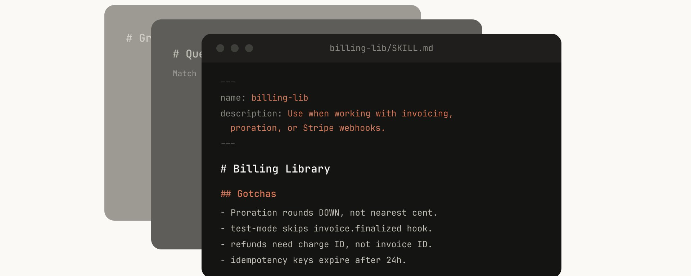
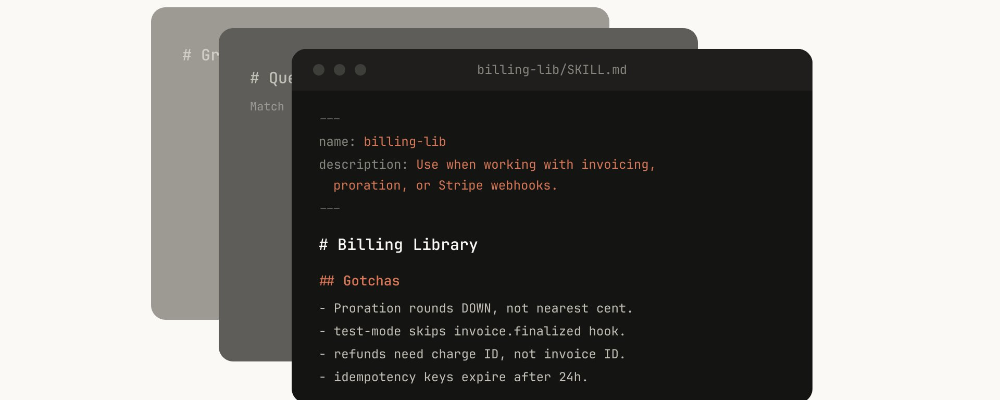
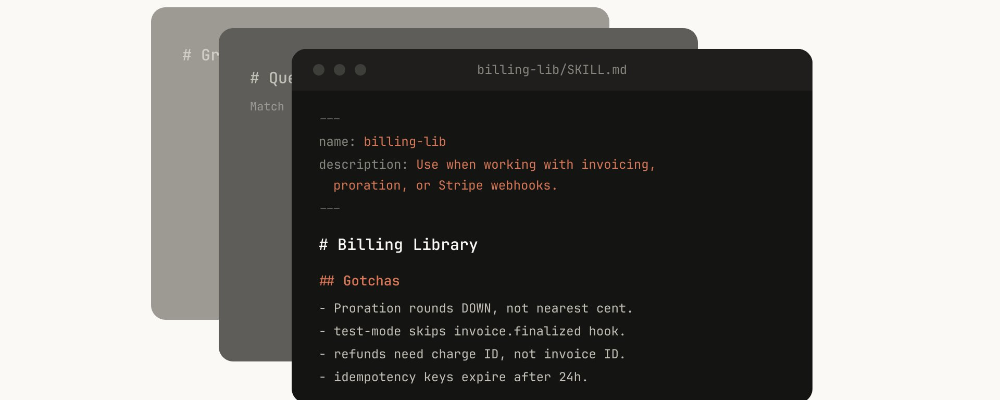
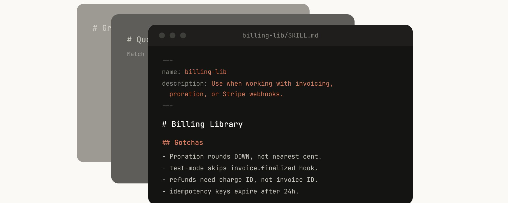

Skills 已成为 Claude Code 中使用最广泛的扩展点之一。它们灵活、易于制作，且分发简单。

但这种灵活性也让人们难以知道什么才是最佳实践。什么类型的 Skills 值得制作？写好 Skill 的秘诀是什么？什么时候应该与他人分享？

我们在 Anthropic 大量使用 Claude Code 的 Skills，目前有数百个 Skills 在活跃使用中。以下是我们学到的关于如何使用 Skills 加速开发的经验。

## 什么是 Skills？

如果你对 Skills 还不熟悉，我建议先阅读我们的[文档](https://code.claude.com/docs/en/skills)或观看我们最新的 [Agent Skills 课程](https://anthropic.skilljar.com/introduction-to-agent-skills)。本文假设你已经对 Skills 有一定了解。

关于 Skills 的一个常见误解是它们"只是 markdown 文件"，但 Skills 最有趣的地方在于它们不仅仅是文本文件。它们是文件夹，可以包含脚本、资源、数据等，Agent 可以发现、探索和操作这些内容。

在 Claude Code 中，Skills 还有[多种配置选项](https://code.claude.com/docs/en/skills#frontmatter-reference)，包括注册动态 Hooks。

我们发现 Claude Code 中一些最有趣的 Skills 创造性地使用了这些配置选项和文件夹结构。

## Skills 的类型

在整理了所有的 Skills 后，我们注意到它们可以归类为几种常见的类型。最好的 Skills 能清晰地归入某一类；而令人困惑的 Skills 往往跨越多个类别。这不是一个详尽的列表，但这是思考你组织内是否缺少某些 Skills 的好方法。

### 1. Library & API Reference

解释如何正确使用库、CLI 或 SDK 的 Skills。这些可以是内部库，也可以是 Claude Code 有时处理不好的常用库。这类 Skills 通常包含参考代码片段文件夹和 Claude 在编写脚本时应避免的陷阱列表。

**示例：**
- **billing-lib** — 你的内部计费库：边缘情况、易错点等
- **internal-platform-cli** — 你的内部 CLI 封装器的每个子命令，附带使用时机示例
- **frontend-design** — 让 Claude 更好地适应你的设计系统

### 2. Product Verification

描述如何测试或验证代码是否正常工作的 Skills。这些通常与 Playwright、tmux 等外部工具配合使用进行验证。

验证 Skills 对于确保 Claude 的输出正确非常有用。让工程师花一周时间完善你的验证 Skills 可能是值得的。

考虑使用一些技术，比如让 Claude 录制其输出的视频，这样你可以确切看到它测试了什么，或者在每一步对状态强制执行程序化断言。这些通常通过在 Skill 中包含各种脚本来实现。

**示例：**
- **signup-flow-driver** — 在无头浏览器中运行注册 → 邮箱验证 → 引导流程，在每个步骤都有状态断言的钩子
- **checkout-verifier** — 使用 Stripe 测试卡驱动结账 UI，验证发票实际处于正确状态
- **tmux-cli-driver** — 用于交互式 CLI 测试，当你验证的东西需要 TTY 时

### 3. Data Fetching & Analysis

连接到你的数据和监控堆栈的 Skills。这些 Skills 可能包含带有凭证的数据获取库、特定的仪表板 ID 等，以及常见工作流程或获取数据的方法说明。

**示例：**
- **funnel-query** — "我需要连接哪些事件来查看注册 → 激活 → 付费"，以及实际拥有规范 user_id 的表
- **cohort-compare** — 比较两个群组的留存或转化，标记统计显著的差异，链接到分段定义
- **grafana** — 数据源 UID、集群名称、问题 → 仪表板查找表

### 4. Business Process & Team Automation

将重复的工作流程自动化为一个命令的 Skills。这些 Skills 通常是很简单的指令，但可能对其他 Skills 或 MCP 有更复杂的依赖。对于这些 Skills，将之前的结果保存在日志文件中可以帮助模型保持一致并反思工作流程的先前执行情况。

**示例：**
- **standup-post** — 聚合你的工单跟踪器、GitHub 活动和之前的 Slack → 格式化的站会，仅显示增量
- **create-<ticket-system>-ticket** — 强制执行模式（有效的枚举值、必填字段）以及创建后的工作流程（通知审核者、在 Slack 中链接）
- **weekly-recap** — 合并的 PR + 关闭的工单 + 部署 → 格式化的周报帖子

### 5. Code Scaffolding & Templates

为代码库中的特定功能生成框架样板代码的 Skills。你可以将这些 Skills 与可组合的脚本结合使用。当你的脚手架有无法纯粹由代码覆盖的自然语言需求时，它们特别有用。

**示例：**
- **new-<framework>-workflow** — 使用你的注解脚手架新的服务/工作流程/处理器
- **new-migration** — 你的迁移文件模板加上常见陷阱
- **create-app** — 新的内部应用，预配置你的认证、日志和部署配置

### 6. Code Quality & Review

在组织内强制执行代码质量并帮助审查代码的 Skills。这些可以包括确定性脚本或工具以获得最大的健壮性。你可能希望将这些 Skills 作为 Hooks 的一部分自动运行，或在 GitHub Action 中运行。

**示例：**
- **adversarial-review** — 生成一个全新视角的子 Agent 进行批评，实施修复，迭代直到发现变成吹毛求疵
- **code-style** — 强制执行代码风格，特别是 Claude 默认做得不好的风格
- **testing-practices** — 如何编写测试以及测试什么的说明

### 7. CI/CD & Deployment

帮助你在代码库中获取、推送和部署代码的 Skills。这些 Skills 可能引用其他 Skills 来收集数据。

**示例：**
- **babysit-pr** — 监控 PR → 重试不稳定的 CI → 解决合并冲突 → 启用自动合并
- **deploy-<service>** — 构建 → 冒烟测试 → 逐步流量推出并比较错误率 → 出现回归时自动回滚
- **cherry-pick-prod** — 隔离的工作树 → cherry-pick → 冲突解决 → 带模板的 PR

### 8. Runbooks

接受症状（如 Slack 线程、警报或错误特征），通过多工具调查，并生成结构化报告的 Skills。

**示例：**
- **<service>-debugging** — 将症状映射到工具和查询模式，用于你流量最高的服务
- **oncall-runner** — 获取警报 → 检查常见嫌疑 → 格式化发现
- **log-correlator** — 给定请求 ID，从可能接触它的每个系统拉取匹配的日志

### 9. Infrastructure Operations

执行例行维护和操作程序的 Skills — 其中一些涉及受益于防护措施的破坏性操作。这些使工程师更容易在关键操作中遵循最佳实践。

**示例：**
- **<resource>-orphans** — 查找孤立的 pods/volumes → 发布到 Slack → 等待期 → 用户确认 → 级联清理
- **dependency-management** — 你的组织的依赖审批工作流程
- **cost-investigation** — "为什么我们的存储/出口账单激增"，包含特定的存储桶和查询模式

## 制作 Skills 的技巧

一旦你决定了要制作的 Skill，如何编写它？以下是我们发现的一些最佳实践、技巧和窍门。

> 我们最近还发布了 [Skill Creator](https://claude.com/blog/improving-skill-creator-test-measure-and-refine-agent-skills)，使在 Claude Code 中创建 Skills 变得更容易。

### 不要说显而易见的事

Claude Code 对你的代码库了解很多，Claude 对编码也了解很多，包括许多默认观点。如果你发布一个主要是关于知识的 Skill，试着专注于那些能推动 Claude 跳出常规思维方式的信息。

[frontend design skill](https://github.com/anthropics/skills/blob/main/skills/frontend-design/SKILL.md) 是一个很好的例子 — 它是由 Anthropic 的一位工程师通过与客户迭代改进 Claude 的设计品味而构建的，避免了像 Inter 字体和紫色渐变这样的经典模式。

### 建立 Gotchas 部分

任何 Skill 中信号最高的内容是 Gotchas 部分。这些部分应该从 Claude 使用你的 Skill 时遇到的常见失败点积累而来。理想情况下，你会随着时间更新你的 Skill 来捕获这些陷阱。

### 使用文件系统和渐进式披露

正如我们之前所说，Skill 是一个文件夹，不仅仅是一个 markdown 文件。你应该将整个文件系统视为一种上下文工程和渐进式披露的形式。告诉 Claude 你的 Skill 中有哪些文件，它会在适当的时候读取它们。

渐进式披露的最简单形式是指向其他 markdown 文件供 Claude 使用。例如，你可以将详细的函数签名和使用示例拆分到 references/api.md 中。

另一个例子：如果你的最终输出是 markdown 文件，你可能在 assets/ 中包含一个模板文件供复制和使用。

你可以有引用、脚本、示例等文件夹，这些都能帮助 Claude 更有效地工作。

### 避免过度限制 Claude

Claude 通常会尝试遵循你的指令，而且由于 Skills 是如此可重用，你需要小心在指令中过于具体。给 Claude 它需要的信息，但给它适应情况的灵活性。例如：

> **太具体：** "当你创建一个新文件时，总是先运行 `npm run lint`，然后 `npm test`，然后 `git add`，然后 `git commit -m '...'`"
>
> **更好：** "创建文件后，确保代码通过 lint 和测试，然后提交更改"

### 仔细考虑设置流程

有些 Skills 可能需要从用户那里获取上下文进行设置。例如，如果你正在制作一个将站会发布到 Slack 的 Skill，你可能想让 Claude 询问要发布到哪个 Slack 频道。

做这件事的一个好模式是将这个设置信息存储在 Skill 目录中的 config.json 文件中，如上面的例子所示。如果配置未设置，Agent 就可以向用户询问信息。

如果你想让 Agent 提出结构化的多选问题，你可以指示 Claude 使用 AskUserQuestion 工具。

### Description 字段是给模型看的

当 Claude Code 启动会话时，它会构建每个可用 Skill 及其描述的列表。这个列表是 Claude 扫描来决定"这个请求是否有对应的 Skill"的内容。这意味着 description 字段不是摘要 — 它是描述何时触发此 Skill 的说明。

### 内存和数据存储

一些 Skills 可以通过在其中存储数据来包含某种形式的内存。你可以将数据存储在简单的追加式文本日志文件或 JSON 文件中，也可以存储在复杂的 SQLite 数据库中。

例如，一个 standup-post Skill 可能会保留一个 standups.log，记录它写的每篇帖子，这意味着下次运行时，Claude 会读取自己的历史并可以告诉自昨天以来发生了什么变化。

> 存储在 Skill 目录中的数据可能会在你升级 Skill 时被删除，所以你应该将其存储在稳定的文件夹中，目前我们提供 `${CLAUDE_PLUGIN_DATA}` 作为每个插件的稳定数据存储文件夹。

### 存储脚本和生成代码

你可以给 Claude 的最强大的工具之一是代码。给 Claude 脚本和库让 Claude 可以将它的轮次花在组合上，决定下一步做什么，而不是重建样板代码。

例如，在你的数据科学 Skill 中，你可能有一个函数库来从事件源获取数据。为了让 Claude 进行复杂的分析，你可以给它一组辅助函数：

Claude 然后可以即时生成脚本来组合这些功能，为"周二发生了什么？"这样的提示做更高级的分析。

### 按需 Hooks

Skills 可以包含只在调用 Skill 时激活的 Hooks，并在会话期间持续有效。将这些用于你不希望一直运行的更有主见的 Hooks，但有时非常有用。

**例如：**
- `/careful` — 通过 Bash 的 PreToolUse 匹配器阻止 rm -rf、DROP TABLE、force-push、kubectl delete。你只在接触生产环境时才需要这个 — 一直开着会让你发疯
- `/freeze` — 阻止不在特定目录中的任何 Edit/Write。在调试时很有用："我想添加日志但我一直在'修复'不相关的东西"

## 分发 Skills

Skills 最大的好处之一是你可以与团队其他成员分享它们。

**有两种方式与他人分享 Skills：**
1. 将你的 Skills 提交到仓库（在 ./.claude/skills 下）
2. 制作 [plugin](https://code.claude.com/docs/en/plugin-marketplaces) 并在 Claude Code Plugin 市场上上传和安装插件

对于在相对较少的仓库中工作的较小团队，将 Skills 提交到仓库效果很好。但每个提交的 Skill 也会稍微增加模型的上下文。随着规模扩大，内部 plugin 市场允许你分发 Skills 并让你的团队决定安装哪些。

### 管理市场

你如何决定哪些 Skills 进入市场？人们如何提交它们？

我们没有集中的团队来决定；相反，我们尝试有机地找到最有用的 Skills。如果你有一个想让人们尝试的 Skill，你可以将其上传到 GitHub 上的沙盒文件夹，并在 Slack 或其他论坛中指向它。

一旦一个 Skill 获得了关注（这由 Skill 所有者决定），他们可以提交 PR 将其移入市场。

> 注意，创建糟糕或冗余的 Skills 可能很容易，所以在发布前确保有某种筛选方法很重要。

### 组合 Skills

你可能希望有相互依赖的 Skills。例如，你可能有一个上传文件的 Skill，以及一个生成 CSV 并上传它的 CSV 生成 Skill。这种依赖管理目前还没有原生内置到市场或 Skills 中，但你可以直接按名称引用其他 Skills，如果它们已安装，模型就会调用它们。

### 衡量 Skills

要了解 Skill 的表现如何，我们使用 PreToolUse Hook，让我们记录公司内的 Skill 使用情况（[示例代码在这里](https://gist.github.com/ThariqS/24defad423d701746e23dc19aace4de5)）。这意味着我们可以找到受欢迎或与我们预期相比触发不足的 Skills。

## 结语

Skills 是 Agent 非常强大、灵活的工具，但现在还处于早期阶段，我们都在摸索如何最好地使用它们。

把这更多看作是我们发现有用的一袋技巧，而不是确定的指南。理解 Skills 最好的方式是开始、实验，看看什么对你有效。我们的大部分 Skills 最初只是几行和一个陷阱，随着 Claude 遇到新的边缘情况，人们不断添加而变得更好。

希望这对你有帮助，如果你有问题请告诉我。
